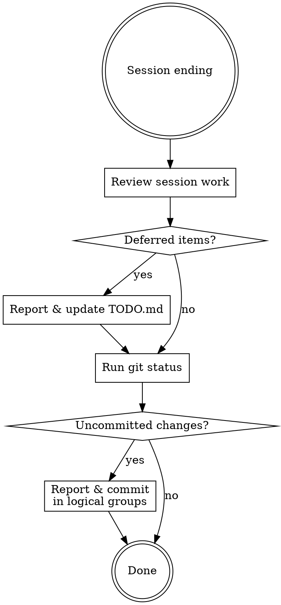

# Wrap Up

End-of-session cleanup that ensures deferred items are tracked and remaining changes are committed.

## Workflow

## Phase 1: Update TODO

### Step 1: Identify Deferred Items

Review the current session's work and identify **all** items, regardless of severity:
- Items explicitly deferred ("let's do this later", "out of scope for now")
- Issues discovered but not addressed (bugs found, improvements noticed)
- Partially completed work that needs follow-up
- Minor suggestions from code reviews (style, naming, small refactors)
- Any "nice to have" improvements noticed during implementation

**Do not filter by severity.** Even minor items should be added to TODO.md so they are tracked and not forgotten.

### Step 2: Report to User

Present the deferred items list to the user **before** modifying TODO.md. Include:
- What was deferred and why
- Any context needed for future sessions

### Step 3: Update TODO.md

- **Add** new deferred/discovered items under appropriate sections
- **Delete** tasks completed during this session or checked tasks
  - Not checked(also [x]), **Delete it**
- Preserve existing structure, formatting, and language of TODO.md

**Red flag:** Do not silently add or remove items. Always report changes to the user.

## Phase 2: Commit

### Step 1: Check Status

Run `git status` to see all uncommitted changes (staged and unstaged).

### Step 2: Categorize and Report

If uncommitted changes exist, report them to the user categorized as:
- **Should commit**: Implementation code, tests, documentation, config changes
- **Should not commit**: Temporary files, debug artifacts, unfinished experiments

Then proceed to commit the "should commit" items without waiting for confirmation.

### Step 3: Commit with Appropriate Granularity

- Group related changes into logical commits (do not lump everything into one commit)
- Use descriptive commit messages following the project's conventions
- Include the original task context in commit messages (if project AGENTS.md requires it)
- Stage specific files by name rather than `git add -A`

## Common Mistakes

| Mistake | Fix |
|---------|-----|
| One giant commit for all changes | Split into logical, reviewable units |
| Forgetting to remove completed TODOs | Cross-reference session work against TODO.md |
| Vague TODO items like "fix later" | Be specific: include context, rationale, code locations |
| Committing debug/temp files | Review `git status` output and categorize before staging |
| Modifying TODO.md without reporting | Always present changes to user first |
