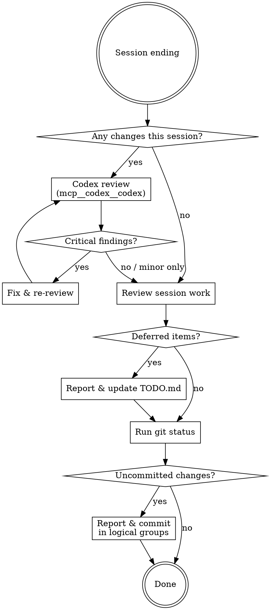

# Wrap Up

End-of-session cleanup: review the session's changes with Codex, track deferred items, and commit remaining changes.

## Workflow

## Phase 1: Codex Review

Get an independent second-opinion review of this session's changes from Codex
via the `codex` MCP server before committing.

### Step 1: Determine Review Scope

Identify what changed this session:
- Uncommitted changes: `git diff HEAD --stat`
- Commits made during this session (if any): `git log --oneline <first-session-commit>^..HEAD`

If nothing changed this session, skip to Phase 2.

### Step 2: Request Review

Call the `mcp__codex__codex` tool. Codex runs in the repo working directory
and can read files and run read-only commands itself — describe the scope,
do not paste the whole diff.

- `prompt`: a self-contained review request. Include:
  - The review scope from Step 1 (e.g. "review `git diff HEAD` plus commits abc123..HEAD")
  - One sentence of task context (what the session set out to do)
  - Output format: findings ranked by severity (critical / major / minor),
    each with `file:line`, a one-sentence problem statement, and a concrete
    failure scenario. Explicitly ask it to say "no findings" if clean.
- `sandbox`: `"read-only"` — the review must not modify the working tree.
- `approval-policy`: `"never"` — the review runs unattended.
- `cwd`: the repo root.

Use `mcp__codex__codex-reply` with the returned `conversationId` for
follow-up questions about specific findings instead of starting a new review.

**Fallback:** if the codex MCP tools are unavailable (server not connected,
`codex` CLI missing), tell the user the review was skipped and why, then
continue with Phase 2. Do not block wrap-up on it.

### Step 3: Triage Findings

Report all findings to the user, then:
- **Critical/major (real bugs, data loss, broken behavior):** fix now, then
  re-run the review on the fix. Verify each finding against the actual code
  first — do not apply a fix for a finding you cannot reproduce or confirm.
- **Minor (style, naming, nice-to-haves):** defer to TODO.md in Phase 2.
- **False positives:** note them briefly to the user; no action.

## Phase 2: Update TODO

### Step 1: Identify Deferred Items

Review the current session's work and identify **all** items, regardless of severity:
- Items explicitly deferred ("let's do this later", "out of scope for now")
- Issues discovered but not addressed (bugs found, improvements noticed)
- Minor findings deferred from the Codex review in Phase 1
- Partially completed work that needs follow-up
- Minor suggestions from code reviews (style, naming, small refactors)
- Any "nice to have" improvements noticed during implementation

**Do not filter by severity.** Even minor items should be added to TODO.md so they are tracked and not forgotten.

### Step 2: Report to User

Present the deferred items list to the user **before** modifying TODO.md. Include:
- What was deferred and why
- Any context needed for future sessions

### Step 3: Update TODO.md

- **Add** new deferred/discovered items under appropriate sections
- **Delete** tasks completed during this session or checked tasks
  - Not checked(also [x]), **Delete it**
- Preserve existing structure, formatting, and language of TODO.md

**Red flag:** Do not silently add or remove items. Always report changes to the user.

## Phase 3: Commit

### Step 1: Check Status

Run `git status` to see all uncommitted changes (staged and unstaged).

### Step 2: Categorize and Report

If uncommitted changes exist, report them to the user categorized as:
- **Should commit**: Implementation code, tests, documentation, config changes
- **Should not commit**: Temporary files, debug artifacts, unfinished experiments

Then proceed to commit the "should commit" items without waiting for confirmation.

### Step 3: Commit with Appropriate Granularity

- Group related changes into logical commits (do not lump everything into one commit)
- Use descriptive commit messages following the project's conventions
- Include the original task context in commit messages (if project CLAUDE.md requires it)
- Stage specific files by name rather than `git add -A`

## Common Mistakes

| Mistake | Fix |
|---------|-----|
| Pasting the full diff into the Codex prompt | Codex reads the repo itself; pass the scope (refs/paths), not contents |
| Blindly applying every Codex finding | Verify each finding against the code before fixing; triage by severity |
| Skipping the review silently when codex is unavailable | Tell the user it was skipped and why, then continue |
| Endless fix/re-review loops | After the second re-review, defer remaining minor findings to TODO.md |
| One giant commit for all changes | Split into logical, reviewable units |
| Forgetting to remove completed TODOs | Cross-reference session work against TODO.md |
| Vague TODO items like "fix later" | Be specific: include context, rationale, code locations |
| Committing debug/temp files | Review `git status` output and categorize before staging |
| Modifying TODO.md without reporting | Always present changes to user first |
