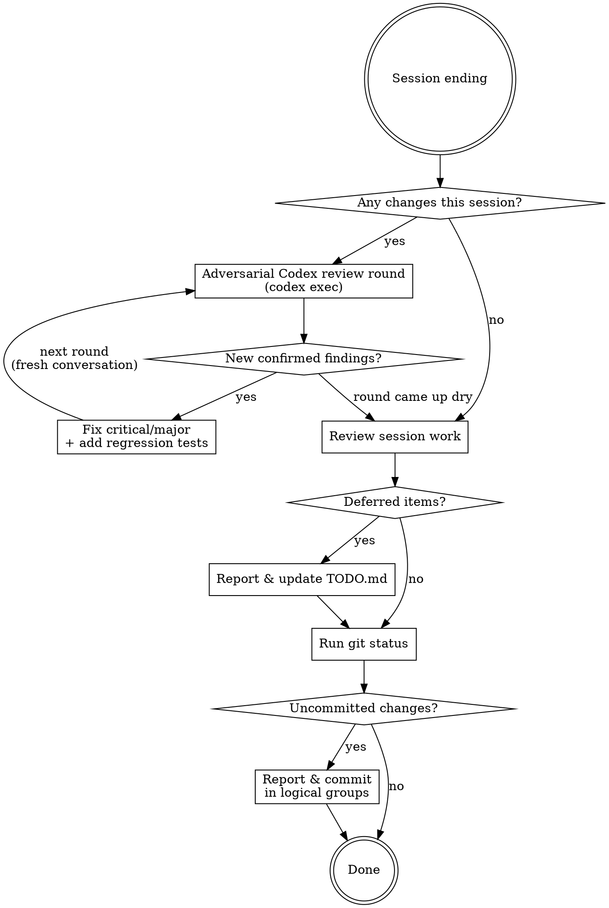

# Wrap Up

End-of-session cleanup: adversarially review the session's changes with Codex, track deferred items, and commit remaining changes.

Wrap-up is the last quality gate before the session ends — invest in the review. Prefer over-reviewing to under-reviewing.

## Workflow



## Phase 1: Adversarial Codex Review

Get an independent **adversarial** review of this session's changes from
Codex before committing. Codex runs as the `codex` CLI in non-interactive
mode (`codex exec`) driven from Bash. There is no MCP server any more
(`codex mcp-server` was removed in codex 0.154.0), so do not look for
`mcp__codex__*` tools. The reviewer's job is to break the changes, not to
approve them: it must assume the diff contains at least one real bug and
hunt for it until the hunt comes up dry.

### Step 1: Determine Review Scope

Identify what changed this session:
- Uncommitted changes: `git diff HEAD --stat`
- Commits made during this session (if any): `git log --oneline <first-session-commit>^..HEAD`

If nothing changed this session, skip to Phase 2.

### Step 2: Run Review Rounds Until Dry

Run review rounds until a round produces **no new confirmed findings**
(max 3 rounds — defer anything still open after that to TODO.md).
Start each round as a **fresh `codex exec` invocation** so rounds stay
independent. Codex runs in the repo working directory and can read files
and run read-only commands itself — describe the scope, do not paste the
whole diff.

Write the round's brief to a scratch file, then launch:

```bash
codex exec --ephemeral -s read-only --color never \
  -C "$(git rev-parse --show-toplevel)" \
  -o "$SCRATCH/codex-round1.md" - < "$SCRATCH/codex-round1-prompt.md"
```

- `-s read-only` — the review must not modify the working tree. Always pass
  it explicitly: the user's `~/.codex/config.toml` defaults to
  `danger-full-access`.
- `-C` — the repo root.
- `-o` — the reviewer's final message lands in this file; read the findings
  from there (stdout is only a progress log).
- `-` + stdin — pass the brief through stdin so backticks and quotes in it
  need no shell escaping.
- `--ephemeral` — nothing is persisted. Drop it only when a follow-up
  question *within* a round is needed: then note the `session id: <uuid>`
  line at the top of stdout and continue with
  `codex exec resume <uuid> -o <file> - < follow-up.md`.
- A real review takes 3–10 minutes. Run it in the background with a Bash
  timeout of at least 600000 ms; do not abort it early.
- Wording: OpenAI's safety filter has rejected briefs phrased as "attack",
  "make the code misbehave", or "steal the tty". Keep the skeptical stance
  but use neutral vocabulary ("independent skeptical review", "construct
  inputs under which the code behaves incorrectly", "routine
  software-quality review of the maintainer's own repository").

The brief must be a self-contained adversarial review request. Include:
- The review scope from Step 1 (e.g. "review `git diff HEAD` plus commits abc123..HEAD")
- One sentence of task context (what the session set out to do)
- **The adversarial stance**: "Assume this diff contains at least one real
  bug. Your job is to find it, not to approve the change. Actively
  construct inputs and states under which the new code behaves
  incorrectly. Question the author's assumptions rather than checking
  their reasoning for plausibility."
- **The round's review lenses** — rotate emphasis across rounds so each
  fresh invocation hunts differently, e.g.:
  - Round 1: correctness and edge cases — boundary values, empty/huge input,
    invalid UTF-8, off-by-one, error paths, unhandled `Result`s
  - Round 2: interactions and regressions — how the diff interacts with
    *unchanged* surrounding code, POSIX-mandated behavior, signals/EINTR,
    state carried across calls, concurrency
  - Round 3: spec conformance and tests — does the change match the POSIX
    text it cites; do existing tests still pin the old behavior; what
    plausible failure has no test covering it
- Output format: findings ranked by severity (critical / major / minor),
  each with `file:line`, a one-sentence problem statement, and a **concrete
  failure scenario (exact input/state → observed wrong behavior)** — a
  finding without a failure scenario does not count. Style and naming
  comments are out of scope for this review. Explicitly require "no
  findings" as the answer when nothing survives its own scrutiny.

In later rounds, also list the previous rounds' findings (including ones
judged false positives, with the refutation) so the fresh reviewer hunts
for *new* bugs instead of re-reporting known ones.

**Fallback:** if the `codex` CLI is missing, not logged in, or `codex exec`
fails (network, or a safety-filter rejection that rewording does not fix),
tell the user the review was skipped and why, then continue with Phase 2.
Do not block wrap-up on it.

### Step 3: Verify and Triage Findings

Be adversarial toward the reviewer too: a finding is only real once **you**
reproduce it. Report all findings to the user, then for each:

1. **Verify first.** Reproduce the claimed failure scenario against the
   actual code — run the input through the shell, or write the failing
   test. Never apply a fix for a finding you could not confirm.
2. **Critical/major (confirmed real bugs, data loss, broken behavior):**
   fix now and pin the fix with a regression test (unit or e2e), then start
   the next review round.
3. **Minor (confirmed but low-impact):** defer to TODO.md in Phase 2 with
   the failure scenario recorded verbatim.
4. **False positives:** report them to the user with the concrete
   refutation (what you ran and what actually happened); no code change.

## Phase 2: Update TODO

### Step 1: Identify Deferred Items

Review the current session's work and identify **all** items, regardless of severity:
- Items explicitly deferred ("let's do this later", "out of scope for now")
- Issues discovered but not addressed (bugs found, improvements noticed)
- Minor findings deferred from the Codex review in Phase 1
- Partially completed work that needs follow-up
- Minor suggestions from code reviews (style, naming, small refactors)
- Any "nice to have" improvements noticed during implementation

**Do not filter by severity.** Even minor items should be added to TODO.md so they are tracked and not forgotten.

### Step 2: Report to User

Present the deferred items list to the user **before** modifying TODO.md. Include:
- What was deferred and why
- Any context needed for future sessions

### Step 3: Update TODO.md

- **Add** new deferred/discovered items under appropriate sections
- **Delete** tasks completed during this session or checked tasks
  - Not checked(also [x]), **Delete it**
- Preserve existing structure, formatting, and language of TODO.md

**Red flag:** Do not silently add or remove items. Always report changes to the user.

## Phase 3: Commit

### Step 1: Check Status

Run `git status` to see all uncommitted changes (staged and unstaged).

### Step 2: Categorize and Report

If uncommitted changes exist, report them to the user categorized as:
- **Should commit**: Implementation code, tests, documentation, config changes
- **Should not commit**: Temporary files, debug artifacts, unfinished experiments

Then proceed to commit the "should commit" items without waiting for confirmation.

### Step 3: Commit with Appropriate Granularity

- Group related changes into logical commits (do not lump everything into one commit)
- Use descriptive commit messages following the project's conventions
- Include the original task context in commit messages (if project CLAUDE.md requires it)
- Stage specific files by name rather than `git add -A`

## Common Mistakes

| Mistake | Fix |
|---------|-----|
| Pasting the full diff into the Codex prompt | Codex reads the repo itself; pass the scope (refs/paths), not contents |
| Writing a neutral "please review" prompt | State the adversarial stance and the round's attack lenses explicitly |
| Accepting a finding without a failure scenario | Require exact input/state → wrong behavior; reproduce it yourself before fixing |
| Blindly applying every Codex finding | Verify each finding against the code before fixing; triage by severity |
| Fixing a bug without pinning it | Add a regression test (unit or e2e) alongside every confirmed fix |
| Reusing one session for all rounds | Start each round as a fresh `codex exec`; carry prior findings forward in the brief instead |
| Calling `codex exec` without `-s read-only` | The user's codex config defaults to full access; always pass the sandbox flag |
| Looking for `mcp__codex__*` tools | They no longer exist (codex ≥ 0.154.0); run `codex exec` from Bash |
| Stopping after one clean-looking round | A round only ends the loop when it produces zero new confirmed findings |
| Endless review loops | Cap at 3 rounds; defer anything still open to TODO.md |
| Skipping the review silently when codex is unavailable | Tell the user it was skipped and why, then continue |
| One giant commit for all changes | Split into logical, reviewable units |
| Forgetting to remove completed TODOs | Cross-reference session work against TODO.md |
| Vague TODO items like "fix later" | Be specific: include context, rationale, code locations |
| Committing debug/temp files | Review `git status` output and categorize before staging |
| Modifying TODO.md without reporting | Always present changes to user first |
